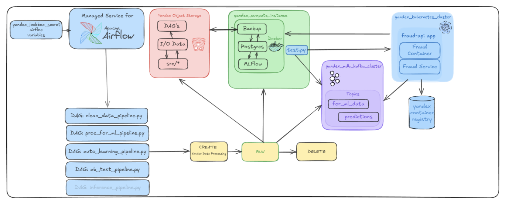
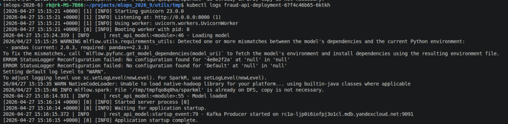
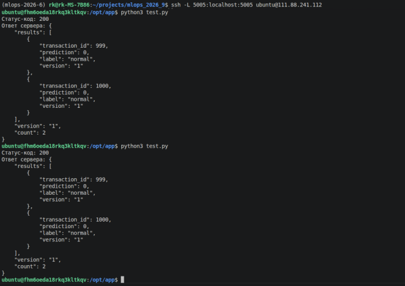
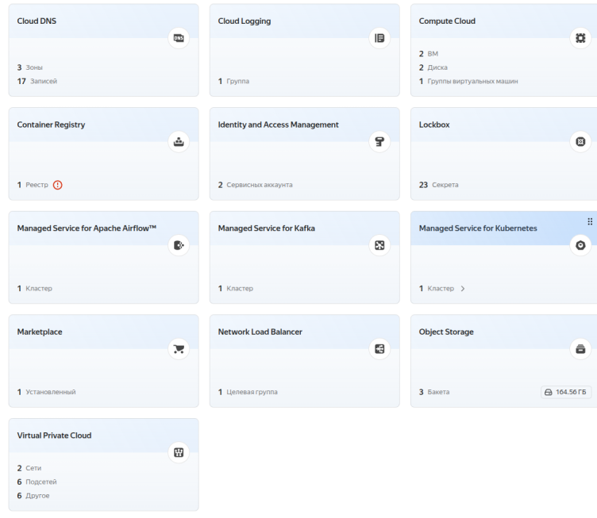
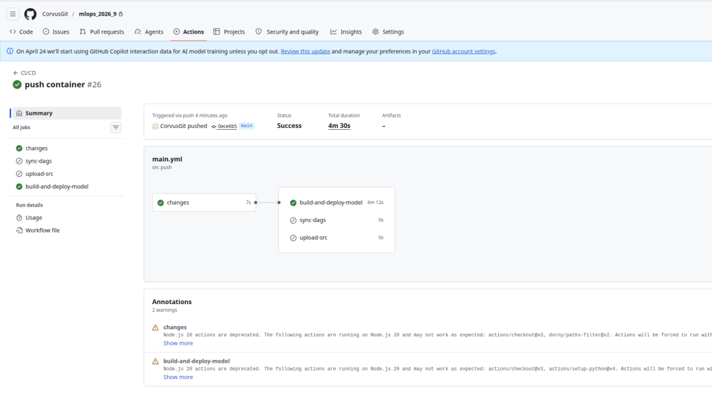
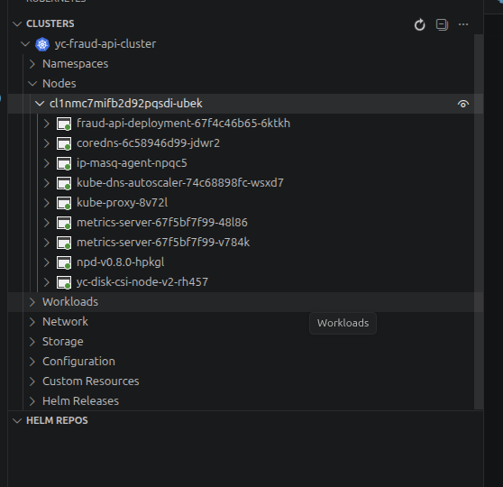
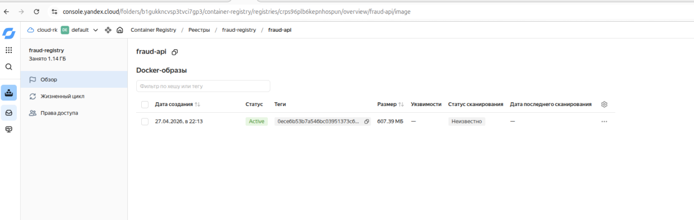
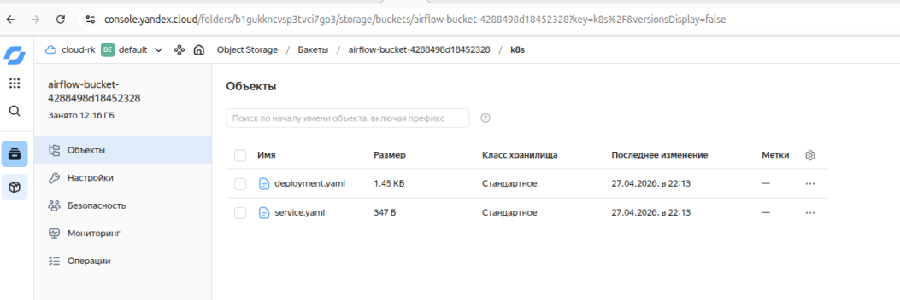
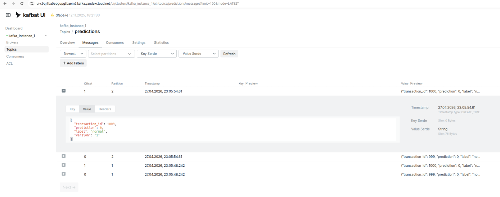
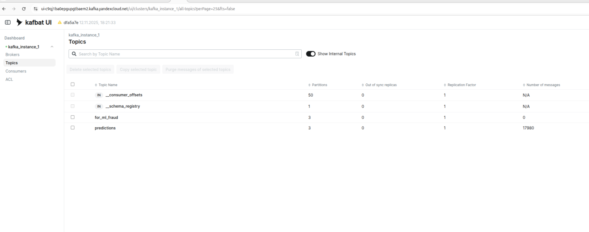

.

Задания:
1. Написано мини-приложение на FastAPI (./restapi/scripts/*): 
    - подключается к MlFlow, скачивает модель
    - подключается к kafka для записи
    - принимает json, делает предсказания, пишет в kafka

Отлажено на minikube, затем перенесено в облако.

.

.

2-5. 
Кластер k8s и реестр образов создаются с помощью terraform. Секреты для github actions подготавливаются в .env

.

Подготовлены манифесты (шаблоны) для развёртывания приложения на k8s (./restapi/k8s/)

Подготовлен манифест для github actions, согласно которому:
- собирается образ (файлы для сборки - ./restapi/)
- собранный контейнер пушится в yandex_container_registry
- по шаблонам манифестов для k8s создаются готовые манифесты и копируются в s3 
- запускаются команды на создание deployment и service в кластере k8s (это небезопасно, в проме нужно что то вроде отдельного DAG на airlow, чтобы не давать доступ к кластеру)

.

.

.

.

С VM внутри облака проведёно успешное тестирование REST API приложения: на основании записываются в топик kafka.

.

.

